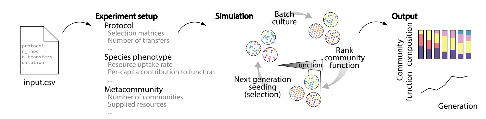

# ecoprospector

> Design protocol for artificially selecting microbial communities

This package is designed for executing community-level selection protocols to engineer microbial communities toward desired functions. The simulation is based on batch culture and the microbes in a community interact via   consumer-resource dynamics.

See our [preprint](https://www.biorxiv.org/content/10.1101/2020.07.24.214775v2) that uses ecoprospector to study a range of selection strategies that direct the evolution of microbial communities.



## Installation

### Mac and Linux

Download the code or clone this github repository to a local directory 

```sh
$ git clone https://github.com/Chang-Yu-Chang/ecoprospector .
```

Browse to the ecoprospector directory and install package 
```sh
$ pip install -e .
```

### Windows


## Usage example

With the mapping file (csv), executing one experiment is simple as 

```sh
$ ecoprospector mapping_file.csv 0
```

For more examples and usage, please refer to the [documentation](https://ecoprospector.readthedocs.io/en/latest/).

## Development setup

A python development setup by [Anaconda](https://docs.anaconda.com/anaconda/install/) will be sufficient to implement ecoprospector.

## Release History

* 0.0.1
    * Work in progress

## Documentation

Ecoprospector's documentation lives at [ecoprospector.readthedocs.io](https://ecoprospector.readthedocs.io/en/latest/)

## Meta

Chang-Yu Chang – [@changyu_chang](https://twitter.com/changyu_chang) – chang-yu.chang@yale.edu

Distributed under the MIT license. See ``LICENSE`` for more information.

[https://github.com/Chang-Yu-Chang/ecoprospector](https://github.com/Chang-Yu-Chang/ecoprospector)


