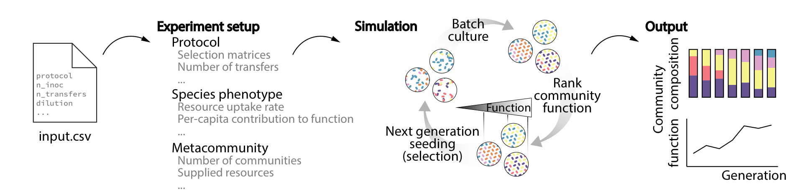

Ecoprospector's Tutorial
=========================================

What is ecoprospector?
======================

Ecoprospector is a Python package designed to simulate protocols of artificial selection on microbial metacommunities. Experiments are run by using a  :code:`mapping_file.csv` as an input. Each row in this csv file corresponds to a single experiment and each column specifies the paramaters for that experiment. Running a single experiment specified in row :code:`i` simply involves the bash command

.. code-block:: bash

    $ ecoprospector mapping_file.csv i

|

Main features
=============

Ecoprospector aims to flexibly adapt major componets of commonly used experiemntal protocols so that they can be tested on in-silico microbial meta-communitities.  The main features of our simulations include:

* **Consumer-resource dynamics**: virtual microbial species with idiosyncratic metabolic properties interact with others in a community through secretion and uptakes. Microbial community dynamics can be adjusted using a wide range of paramaters
* **Batch-culture**: the community generation is divided into serial batch culture with a tunable incubation time and number of generations.
* **Community function**: any arbitrarily designed community functions can be under selection.
* **Selection matrix**: the selection regimes (i.e., which parental communitues to select and how to seed the offspring communities) are standardized by selection matrix at the end of each generation.
* **Pertubations**: at end of any generation the top performing community can be replicated and copies can be be perturbed simulating possibe manipulations (i.e single-species invasions, resource-shifts, bottle-necking etc).
* **Modular protocol design**: the feature mentioned above can be assembled in any combination to form a user designed experimental protocol.

Our package is designed with three types of user in mind.

* **Beginners** who have no python experience would be able to re-run all the simulations presented in this paper using the csv file alone and should be able to repeat pre-coded experimental protocols under varying parameter choices.
* **Intermediate users** who have basic knowledge of python, should be able to code up their own protocols and may also be able to perform simple extensions to the package (such as introducing new types of community function, or selection matrices).
* **Advanced users** who are familiar with python coding should be able to add additional functionality to the package, including carrying over several features of community-simulator that are not currently in use. This includes but is not limited to  a) introducing intrinsic resource dynamics (for chemostat simulations) b) alternative dynamical models such as Lotka-Volterra models.

|

Key contributors
================

Jean Vila and Chang-Yu Chang (both at Yale working with `Alvaro Sanchez <http://www.sanchezlaboratory.com/>`_) started to build ecoprospector in collaboration with students from Physical Biology of Cells Course at Marine Biology Laboratoy in Woods Hole (Molly Bassette, Julia Borden, Stefan Golfier, Paul G. Sanchez, Rachel Waymack, Xinwen Zhu), who provided assistance during early development.

|

.. toctree::
   :maxdepth: 2
   :caption: Getting Started

   content/installation
   content/quickstart

.. toctree::
   :maxdepth: 2
   :caption: User Guide

   content/usertools
   content/mapping_file
   content/micrm
   content/metacommunity
   content/protocol
   content/community_function
   content/selection_matrix
   content/perturbation

